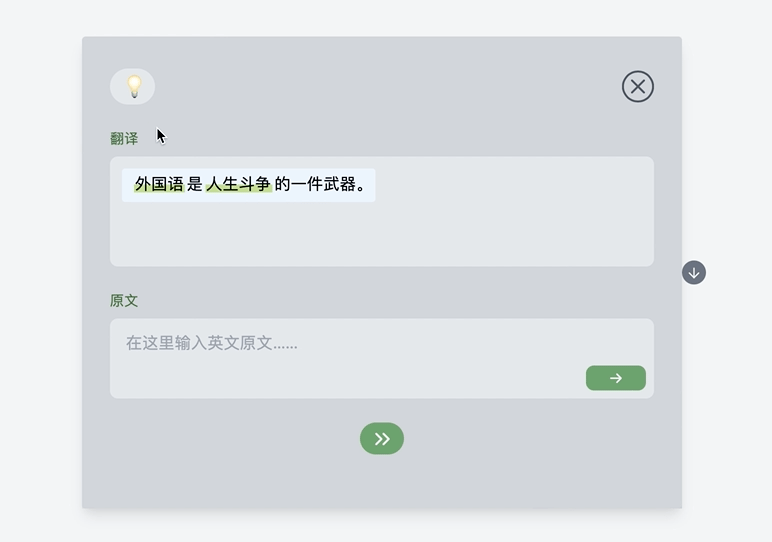
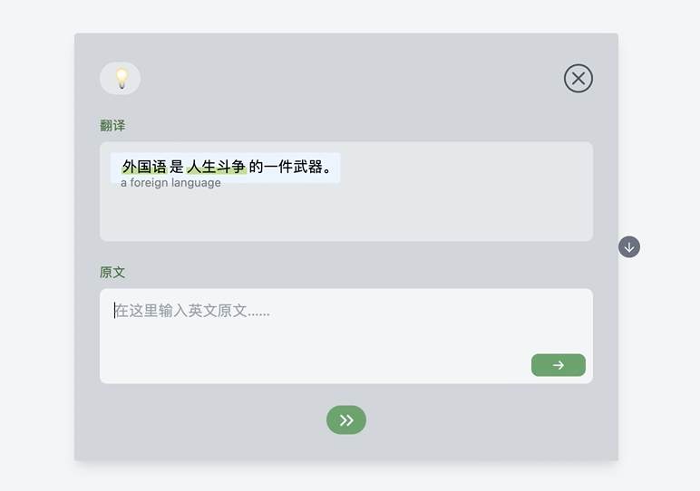

# HideSentence

谜底句子，一个基于句子的英语学习工具。

有人说，想要学会音标必须开口读单词，想要学会单词必须理解句子，这跟机器学习语言的方法类似，机器不翻字典，也不背单词，想要让机器理解词意，只需要让他看到这个单词在句子中怎么用就可以了，著名的遮蔽语言模型（MLM）就是把单词遮住，让机器看前后文来反推词意。

而今天多数给人用的英语学习软件，尽管给出了例句，但也都是通过反复看单词来记忆，于是我做了一个完全基于句子的记忆软件。

就叫谜底句子吧。

这里是一小部分[figma设计稿](https://www.figma.com/file/xTE0aGilPCEVx0FaHUmz6L/%E5%88%B7%E5%8F%A5)，边写边设计，没有全部都做设计稿。

## 启动项目

```
npm build	//安装依赖

npm start	//启动
```


## 特点

### 练习界面

首页选中想要默写的句子，点击“开始练习”，底部弹出默写句子界面。


开始默写句子，遇到不会的单词/短语可以点击标注的词，底部显示提示。



填写错误，窗体抖动（类似Mac登陆密码输错），填写正确，撒花并自动跳到下一个单词。



点击右下角按钮回到首页列表。


### 添加句子

点击添加按钮添加句子。


在Tag中输入要记忆的单词，然后输入句子和翻译，点击下一步进入标注界面。


选中单词添加标注。


点击完成后单词会被添加到列表的末尾。
